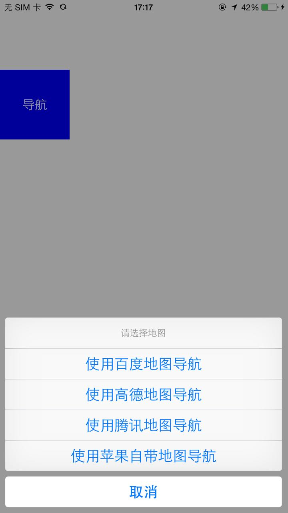

# map
地图导航 百度地图导航 URL 地图导航

# 功能
* 通过URL API 封装 高德导航， 百度地图导航， 苹果内置地图导航
* CLLocation+ABLocationTransform 类进行各种地图坐标系之间转换 

# 简单使用
```
[[CPMapNavigation sharedMapNavigation] clickGotoMapWithDestinationName:@"目标" 
                                      DestinationCoordinate:CLLocationCoordinate2DMake(39.99517568, 114.41148289) 
                                       originCoordinate: CLLocationCoordinate2DMake(39.99517568, 110.41148289)];
                                       
                                       
                                      
```


